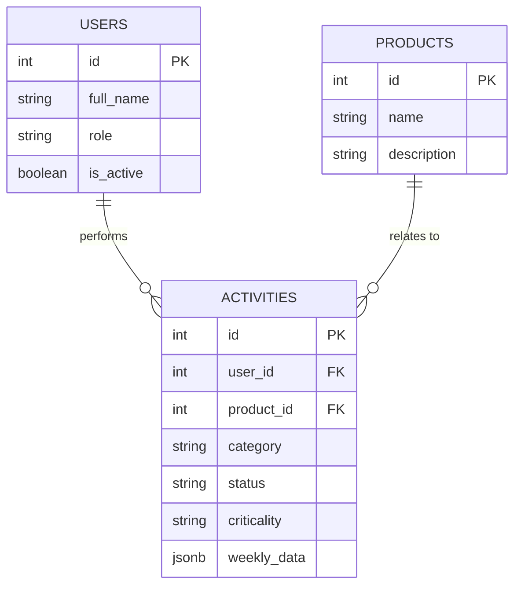
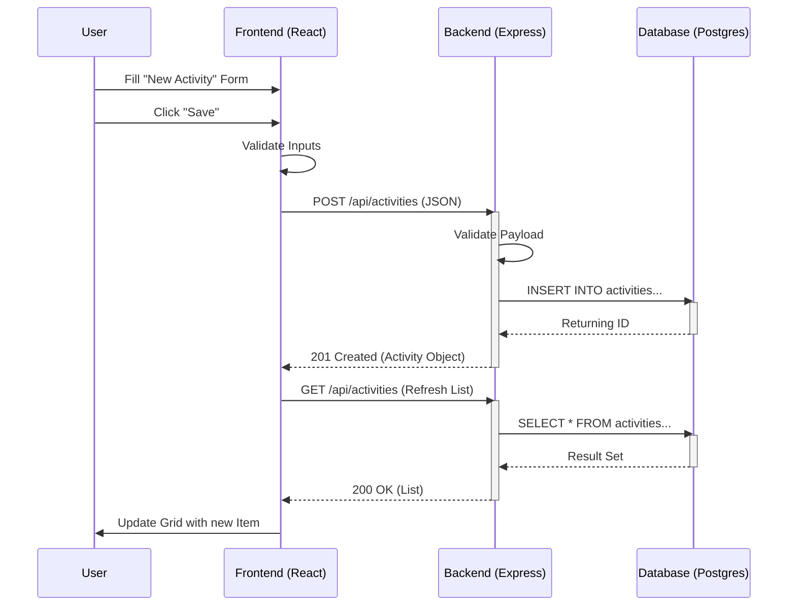
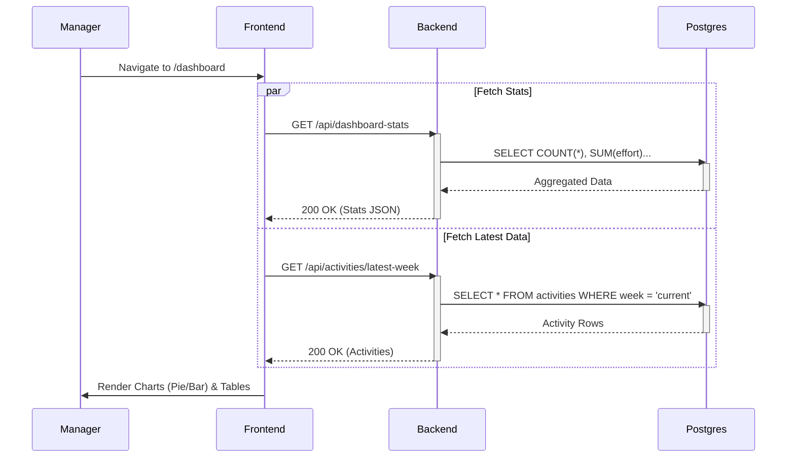
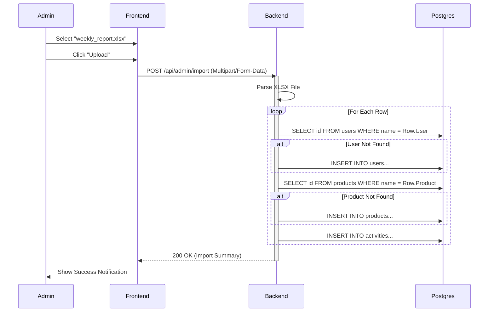

# Architecture Document

## 1. Executive Summary

### Vision
The Activity Tracking System is designed as a modern, containerized web application to centralize and streamline the weekly activity reporting for a 15-person telecom technical team. It replaces manual, error-prone Excel processes with a robust database-backed solution that offers real-time visibility, enforceable data integrity, and automated reporting.

### Key Goals
- **Data Integrity**: Transition from free-form text to structured, validated data entry.
- **Operational Efficiency**: Reduce time spent on consolidation and reporting through automated dashboards.
- **Scalability**: A Dockerized microservices-ready architecture that can easily expand to accommodate more users or integrate with other enterprise systems (LDAP, JIRA).
- **Intelligence**: Leverage local LLMs (Ollama) for automated executive summaries and insights.

---

## 2. System Overview

### High-Level Design (HLD)
The system follows a standard **Three-Tier Architecture** fully encapsulated within a **Docker Compose** environment.

```mermaid
graph TB
    subgraph Client_Workstation [Client Workstation]
        Browser[Web Browser]
    end

    subgraph Docker_Host [Docker Host (Local/Server)]
        direction TB
        subgraph Frontend_Container [Frontend Container :3000]
            Nginx[Vite/Nginx Server]
            ReactApp[React Application]
        end
        
        subgraph Backend_Container [Backend Container :5000]
            Express[Express.js App]
            Auth[Auth Middleware]
            Controllers[Controllers]
        end

        subgraph Data_Container [Database Container :5432]
            Postgres[(PostgreSQL)]
        end

        subgraph AI_Container [AI Container :11434]
            Ollama[Ollama Service]
            Llama3[Llama3 Model]
        end
    end

    Browser -->|HTTP / REST API| Nginx
    Nginx -->|Serve Static Files| Browser
    Browser -->|Direct API Calls (Proxy)| Express
    
    Express -->|SQL Query| Postgres
    Express -->|HTTP POST (Prompt)| Ollama
    
    classDef container fill:#e1f5fe,stroke:#01579b,stroke-width:2px;
    classDef db fill:#fff9c4,stroke:#fbc02d,stroke-width:2px;
    classDef external fill:#f3e5f5,stroke:#7b1fa2,stroke-width:2px;
    
    class Frontend_Container,Backend_Container,AI_Container container;
    class Postgres db;
    class Browser external;
```

### Components
1.  **Frontend Layer**: A Single Page Application (SPA) built with React and Vite, utilizing Material-UI for a consistent enterprise design system.
2.  **Backend Layer**: A RESTful API built with Node.js and Express, handling business logic, data validation, and database interactions.
3.  **Data Layer**: PostgreSQL database for persistent storage of users, products, and activity logs.
4.  **AI Layer (Optional)**: Integration with Ollama for generating natural language summaries of weekly activities.

---

## 3. Component Architecture

### 3.1 Frontend (Presentation Layer)
- **Framework**: React 18 with Vite (for fast HMR and build performance).
- **UI Library**: Material-UI (MUI) v5.
    - **Theming**: Custom dark/light mode support using MUI's `ThemeProvider`.
    - **Layout**: Responsive grid system adapting to desktop and tablet views.
- **State Management**: React `useState` and `useEffect` hooks for local state; Context API for global user/theme state (if needed).
- **Data Visualization**: Recharts for rendering effort accumulation (Bar Charts) and status distribution (Pie Charts).
- **Routing**: React Router v6 for navigation between Activity List, Admin Panel, and Dashboard.
- **HTTP Client**: Axios with configured interceptors for base URL negotiation.

### 3.2 Backend (Application Layer)
- **Runtime**: Node.js.
- **Framework**: Express.js.
- **Security**:
    - `cors` for Cross-Origin Resource Sharing.
    - Input validation middleware (ensuring required fields like `category`, `status`, `product_id` are present).
- **Data Access**: `pg` (node-postgres) for direct SQL queries.
    - **JSONB Implementation**: `weekly_data` column stores flexible metrics.
    - **Bulk Import**: `multer` and `xlsx` for parsing processing.
- **API Structure**:
    - `/api/activities`: CRUD operations.
    - `/api/stats`: Dashboard aggregations.
    - `/api/admin/import`: Excel processing.

### 3.3 Data Layer (Database)
- **Schema Diagram:**


---

## 4. User Scenarios & Sequence Diagrams

### 4.1 Weekly Activity Entry (Create Flow)
**Scenario**: A team member logs a new activity for the week.



### 4.2 Executive Dashboard Review (Read Flow)
**Scenario**: A manager views the team's performance dashboard.



### 4.3 Bulk Data Migration (Admin Flow)
**Scenario**: Admin uploads an Excel file to bulk import legacy data.



---

## 5. Microservices & Integrations

| Service Name | Technology | Protocol | Responsibility | Port |
| :--- | :--- | :--- | :--- | :--- |
| **frontend** | React/Nginx | HTTP/1.1 | UI serving and static assets | 3000 |
| **backend** | Node.js | REST/JSON | Business logic & Data Aggregation | 5000 |
| **db** | PostgreSQL | TCP/IP | Persistent data storage | 5432 |
| **ollama** | Go/LLM | HTTP/REST | AI Generation (Inference) | 11434 |

---

## 6. Operational Blueprints

### 6.1 Technical Operations (DevOps)
- **Deployment Strategy**: Recreate strategy (Down/Up) is sufficient for this scale.
- **Log Management**: Standard Docker logging (`json-file`), accessible via `docker logs`.
- **Health Checks**:
    - Backend: `/api/health`
    - Frontend: Static HTTP check on port 3000.

### 6.2 Business Operations
- **Monday Morning**: Review Dashboard for "New Issues".
- **Friday Afternoon**: Ensure all team members have "Submitted" status.
